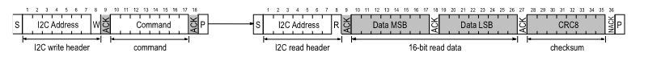

# SHT40 SENSOR

</br>
This section provides a detailed explanation of the embedded system aspect of our project, focusing specifically on the Grove SHT40 Temperature and Humidity Sensor.

## Hardware Components

#### Microcontroller Development Kit

We utilize an STM32 microcontroller development kit to build and debug code for our project. This development kit is provided by the ENIB internal pack used in our course (SDK pack), enabling efficient development and debugging of firmware for the embedded system.


## Software Implementation

Before we can utilize the SHT40 sensor, it is crucial to establish communication with it using the I2C protocol and configure it with the appropriate settings. To achieve this, we need to implement basic functions that facilitate communication with the sensor. These functions serve as the foundation for all subsequent interactions with the sensor.

## Project Structure

To integrate the SHT40 sensor into our project, you'll need to follow these steps:

1. Create the necessary files:
   - `sht40.h`: Header file for SHT40 sensor interface.
   - `sht40.c`: Source file for SHT40 sensor implementation.


## Essential Functions for Sensor Communication

To interact with the SHT40 sensor, we implement the following fundamental functions:


1. **`sht4x_write(uint8_t reg, uint8_t value)`:** This function writes a single byte of data to a specified register of the sensor..

```cpp

    static int16_t sht4x_write(uint8_t reg, uint8_t value) {
        uint8_t data[2];
        data[0] = reg;
        data[1] = value & 0xFF;
        return i2c_write(I2C1, SHT4X_ADDRESS, data, sizeof(data));
    }

```

2. **`read(uint8_t reg , int delay)`:** This function reads a single byte of data from a specified register of the sensor.
   
```cpp

    static uint8_t sht4x_read(uint8_t reg, int delay) {
        uint8_t value;
        uint8_t reg_data[1] = {reg};
        
        if (i2c_write(I2C1, SHT4X_ADDRESS, reg_data, 1) != I2C_OK) {
            uart_puts(_USART2, "\n\rErreur lors de l'écriture dans le registre\n");
            return 0;
        }

        delay_us(delay);

        if (i2c_read(I2C1, SHT4X_ADDRESS, &value, 1) != I2C_OK) {
            uart_puts(_USART2, "\n\rErreur lors de la lecture d'octets\n");
            return 0;
        }

        return value;
    }
   
```

3. **`write_n(uint8_t reg, uint8_t* values, uint8_t length)`:** This function writes multiple bytes of data to consecutive registers of the sensor.
   
```cpp

    static int16_t sht4x_write_n(uint8_t reg, uint8_t* values, uint8_t length) {
        uint8_t data[length + 1];
        data[0] = reg;
        for (size_t i = 0; i < length; i++) {
            data[i + 1] = values[i];
        }
        return i2c_write(I2C1, SHT4X_ADDRESS, data, sizeof(data));
    }

```

4. **`read_n(uint8_t reg, uint8_t* values, uint8_t length, int delay)`:** This function reads multiple bytes of data from consecutive registers of the sensor.
   
```cpp
    
    void read_n(uint8_t reg, uint8_t* values, uint8_t length, int delay) {
        uint8_t reg_data[1] = {reg};

        if (i2c_write(I2C1, SHT4X_ADDRESS, reg_data, 1) != I2C_OK) {
            uart_puts(_USART2,"\n\rErreur lors de l'écriture dans le registre\n");
            return I2C_ERROR;
        }

        delay_us(delay);

        if (i2c_read(I2C1, SHT4X_ADDRESS, values, length) != I2C_OK) {
            uart_puts(_USART2,"\n\rErreur lors de la lecture d'octets\n");
            return;
        }
    }
   
```

5. **`sht4x_write_cmd(const uint8_t* cmd)`:** This function writes a command to the sensor.
   
```cpp
    static int16_t sht4x_write_cmd(const uint8_t* cmd) {
        return i2c_write(I2C1, SHT4X_ADDRESS, cmd, 1);
    }
```

5. **`sht4x_write_cmd(const uint8_t* cmd)`:** This function writes a command to the sensor.
   
```cpp
    static int16_t sht4x_write_cmd(const uint8_t* cmd) {
        return i2c_write(I2C1, SHT4X_ADDRESS, cmd, 1);
    }
```

These functions provide the necessary groundwork for interacting with the SHT40 sensor via the I2C protocol. Once implemented, we can proceed with initializing the sensor and configuring it according to our project requirements.


## Key Details about the SHT40 Sensor

#### I2C Communication:

- **Specification:** Based on NXP’s I2C-bus specification.
- **Supported Modes:** Standard, fast mode, and fast mode plus.
- **Data Transfer:** Transferred in multiples of 16-bit words with an 8-bit checksum (CRC).
- **Addressing:** 7-bit I2C address followed by an eighth bit, denoting communication direction.
- **Documentation:** [SHT40 Documentation](https://wiki.seeedstudio.com/Grove-SHT4x/)

#### Data Type & Length:

- **Operates with:** 8-bit data packages.
- **Checksum:** Included after every second 8-bit data package.
- **Transmission:** Humidity and temperature data transmitted in a specific format.

#### Checksum Calculation:

- **For Read Transfers:** Each 16-bit data is followed by a checksum using CRC-8 algorithm.

#### Command Overview:

- **Various Commands:** Available for different operations like measuring temperature and humidity, reading serial number, etc.

Refer to the [documentation](https://wiki.seeedstudio.com/Grove-SHT4x/) for detailed specifications and usage instructions.

## Sensor Initialization

To use the SHT40 sensor, we need to initialize the I2C communication and configure the sensor. For initialization, we first read the serial number to ensure that the sensor is connected and functioning properly. The process involves detecting if a sensor is connected by reading the ID register. If the sensor does not respond or if the response is not the expected value, the test fails.

```cpp
/**
 * Detects if a sensor is connected by reading out the ID register. If the sensor does not answer
 * or if the answer is not the expected value, the test fails.
 *
 * @return 0 if a sensor was detected
 */
int16_t sht4x_probe(void);

int16_t sht4x_probe(void) {
    uint32_t serial;
    return sht4x_read_serial(&serial);
}

```

```cpp
// Internal function to retrieve the number of words divided by the word size (2 bytes)
#define SENSIRION_WORD_SIZE 2
#define SENSIRION_NUM_WORDS(x) (sizeof(x) / SENSIRION_WORD_SIZE)

// Duration necessary to write command
#define SHT4X_CMD_DURATION_USEC 

int16_t sht4x_read_serial(uint32_t* serial) {
    const uint8_t cmd = SHT4X_CMD_READ_SERIAL;
    int16_t ret;
    uint16_t serial_words[SENSIRION_NUM_WORDS(*serial)];
    ret = write_cmd(&sht4x_cmd_measure);
    if (ret)
        return ret;
    read_n((uint8_t*)serial_words,sizeof(serial_words));
    *serial = ((uint32_t)serial_words[0] << 16) | serial_words[1];
    return I2C_OK;
}

```

## Task One

After initialization, we can now retrieve the temperature and humidity data. To do this, we need to create a function that allows us to read the temperature and humidity. Below is the function we developed:

```cpp
int16_t sht4x_measure_blocking_read(float* temperature, float* humidity) {
    int16_t ret;
    ret = write_cmd(&sht4x_cmd_measure);
    if (ret)
        return ret;
    delay_us(sht4x_cmd_measure_delay_us);
    return sht4x_read_measurement(temperature, humidity);
}

```

####Function Explanation

To read the temperature, we start by writing a command. After this, we can read the data. Similar to other sensors where a register pointer is used, we first send a write header to the I2C slave followed by a command. For example, "measure RH&T with highest precision." After the measurement is finished, the read request directed to the I2C slave will be acknowledged, and the transmission of data will be started by the slave.

####Here is an image explaining the process:



After sending the command, we can read the temperature and humidity. We need to use a formula to convert each value correctly. Refer to the documentation [SHT40 Documentation](https://wiki.seeedstudio.com/Grove-SHT4x/) for more details.

```cpp

int16_t sht4x_read_measurement(float* temperature, float* humidity) {
    uint16_t rawTemp, rawHumd;
    uint16_t words[2];
    int16_t ret = read_n(words,SENSIRION_NUM_WORDS(words));
    if (ret)
        return ret;
    /**
     * formulas for conversion of the sensor signals, optimized for fixed point
     * algebra:
     * Temperature = 175 * S_T / 65535 - 45
     * Relative Humidity = 125 * (S_RH / 65535) - 6
     */

    rawTemp = ((uint16_t) words[0] << 8) | words[1];
    rawHumd = ((uint16_t) words[2] << 8) | words[3];

    *temperature = (-45.0f + 175.0f * (rawTemp / 65535.0f));
    *humidity = (-6.0f + 125.0f * (rawHumd / 65535.0f)); 

    return ret;
}

```

## Task Two

Great, now we can test if this works well. We need to use serial UART ST-LINK to display the current temperature and humidity in the terminal. Here is a test where we define main.c. We will do the first test by adding some code to transform a float into two parts: the integer part and the decimal part.


```cpp

#include "libshield/sht4x.h"
#define delay_us(us)        timer_wait_us(_TIM3, us)


static void on_command_received(char c) {
    command = c;
}

int main(void) {
    uart_init(_USART2, 115200, UART_8N1, on_command_received);
    i2c_master_init(_I2C1);
    while (sht4x_probe() != 0) {
        uart_printf(UART_TO_USE, "SHT sensor probing failed\n");
        delay_us(1000);	 // Sleep 1s
    }

    while (1) {
                float temperature, humidity;
                int8_t ret = sht4x_measure_blocking_read(&temperature, &humidity);
                if (ret == 0) {
                    int temp_int = (int) temperature;
                    float temp_frac = temperature - temp_int;
                    int hum_int = (int) humidity;
                    float hum_frac = humidity - hum_int;

                    int temp_int_frac = (int)(temp_frac * 1000);
                    int hum_int_frac = (int)(hum_frac * 1000);

                    uart_printf(UART_TO_USE, "\r\ntemperature: %d.%d C", temp_int, temp_int_frac);
                    uart_printf(UART_TO_USE, "\r\nhumidity: %d.%d", hum_int, hum_int_frac);

                    delay_us(1000);	 // Sleep 1s

                } else {
                    uart_printf(UART_TO_USE, "\r\nError reading measurement");
                }
                break;
    }
    return 0;
}
    
```
## Summary

In this section, we include the essential details about the SHT40 sensor, its basic functionalities, and how to interface it with a microcontroller to read and display temperature and humidity values using UART. We also provide a sample code implementation for initializing the sensor, reading data, and handling errors. After this, we will add more extra features and improvements to enhance the functionality and reliability of the system.