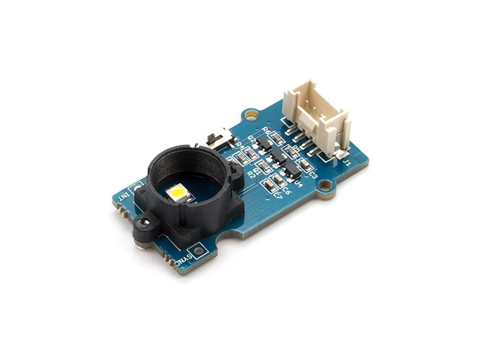

# Project Homepage

## Welcome to Our Project Homepage

Welcome to the documentation of our embedded system project, developed by students at the École Nationale d'Ingénieurs de Brest (ENIB). Our project focuses on configuring and retrieving information from two sensors: a color sensor (I2C) and a temperature and humidity sensor.

## Project Overview

In this project, we integrated two types of sensors to collect environmental data:

- **Color Sensor (I2C)**: This sensor detects the color of objects and communicates the data via the I2C protocol.
- **Temperature and Humidity Sensor**: This sensor measures ambient temperature and humidity levels.

## Sensors Used

### Grove - SHT40 Temperature and Humidity Sensor

The Grove SHT40 digital sensor is based on Sensirion's industry-proven humidity and temperature sensors. It provides consistent temperature and humidity accuracy over a wide measurement range.

### Grove - TCS34725CS Color Sensor

The TCS34725CS color sensor with digital I2C output is based on an 8x2 array of filtered photodiodes and 16-bit analog-to-digital converters. It measures the chromaticity of ambient light or objects. Among the 16 photodiodes, 4 have red filters, 4 have green filters, 4 have blue filters, and 4 have no filter (clear). The synchronization input pin allows precise synchronous conversion control using an external pulsed light source.

